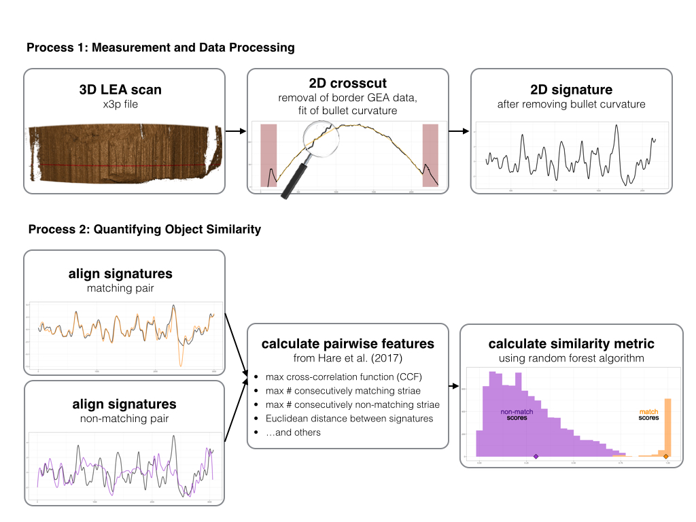

\newcommand{\hh}[1]{{\color{orange}{#1}}}
\newcommand{\kr}[1]{{\color{teal}{#1}}}
\newcommand{\ug}[1]{{\color{purple}{#1}}}


```{r, echo = F, warning = F, message = F}
library(tidyverse)
library(x3ptools)
library(lme4)
```
# Introduction 

## Intro to Gauge R&R  

Gauge Repeatability and Reproducibility (Gauge R\&R) studies are traditionally used in engineering fields as part of measurement systems analysis. Gauge R\&R studies focus on measuring the repeatability and reproducibility of a measurement process within and across environmental conditions. Their study design assumes a univariate measurement value resulting from some measurement process, and aims to quantify sources of variability around a single measurement average.  

Consider the length of a manufactured screw, $y$. If the length of that screw $y$ is measured by multiple operators using multiple tools, a Gauge R\&R model can be used to determine to what degree the variability in the set of resulting measurements can be attributed to differences across operators or tools.  

Gauge R\&R studies utilize a basic random-effects model, with one overall measurement mean and a set of random effects corresponding to study design factors, such as operator and device. The quantities of interest are primarily the variance components associated with each random effect, which investigate both the overall measurement process variability as well as the degree to which measurement variability is associated with each study factor.  

There are several useful applications of variance components obtained from a Gauge R&R study. One major outcome is the ability to compare any two objects for similarity. Consider the difference in measured length between two manufactured screws, say $y_a$ and $y_b$: $y_a - y_b = d$. We can assess whether the magnitude of $d$ falls within a reasonable range of measurement variability given quantified repeatability and reproducibility components. If the difference in measured length $d$ falls within an acceptable range, the two objects can be considered quantitatively very similar after allowing for variability in measurement.  

The length of the screw in our example is a univariate response measurement. Comparing two objects for similarity and accounting for measurement error is more challenging when working with complex data structures.  

## Intro to complex data structures  

The birth of data science and significant improvements in computing power have opened up new avenues in measurement systems analysis. Data collection and analyses are much quicker and easier today than ever before. Data collected to analyze measurement systems can include more information and take on more complex structures.  

Consider our example of screw length. We can gather additional characteristics of the screw, such as width of the head, length of threading, or depth of the drive. The problem of comparing the set of screw characteristics measured on any two manufactured screws and determining whether they are sufficiently similar is more difficult.  

The same idea applies in the field of data science, which often leverages complex data structures. Data science often deals in "pipelines" that begin with complex data structures, apply sequential actions to the data to extract useful information, and achieve some quantitative result. In many applications, the pipeline involves data captured using some measurement system, and there is measurement uncertainty associated with the resulting data.  

In order to leverage complex data structures while taking measurement reproducibility into account, we must adapt the definition of distance between any two objects with complex structure, and carefully consider how we apply statistical models to quantify measurement variability.  

  

```{r, echo = F, warning = F, message = F, eval = F}
barrel6_example <- readRDS("../../CSAFE-ISU/bullet-scan-variability/data/barrel6_example_x3p.rda")

process_scan_nonmatch <- readRDS("data/process_scan_nonmatch.rda")

process_scan_nonmatch <- process_scan_nonmatch %>% mutate(
  ccdata = purrr::map(ccdata, .f = function(ccdata){
    ccdata %>% group_by(y) %>% summarise(x = mean(x, na.rm = T), value = mean(value, na.rm = T))
  })
)
process_scan_nonmatch$ccdata[[1]] %>% ggplot() + geom_line(aes(x = y, y = value)) + geom_vline(xintercept = 175) + geom_vline(xintercept = 2145)

process_scan_nonmatch <- process_scan_nonmatch %>% mutate(grooves = purrr::map(x3p, .f = function(x3p){return(list(groove = c(175, 2145)))}))
process_scan_nonmatch <- process_scan_nonmatch %>% mutate(new_ccdata = purrr::map(ccdata, .f = function(ccdata){
  new_ccdata <- data.frame(x = ccdata$y, y = ccdata$x, value = ccdata$value)
  return(new_ccdata)
}))
process_scan_nonmatch <- process_scan_nonmatch %>% mutate(
  sigs = purrr::map2(
    .x = new_ccdata, .y = grooves,
    .f = function(x, y) {
      bulletxtrctr::cc_get_signature(
        ccdata = x, grooves = y, span1 = 0.75, span2 = 0.03)
    })
)
saveRDS(process_scan_nonmatch, "data/process_scan_nonmatch.rda")

process_scan_match <- barrel6_example %>% filter(Barrel == "Barrel 5", Bullet == "Bullet 1", Land == "Land 4")
process_scan_match <- process_scan_match %>% mutate(crosscut = bulletxtrctr::x3p_crosscut_optimize(x3p[[1]]))
#process_scan$crosscut <- 200
process_scan_match <- process_scan_match %>% mutate(ccdata = purrr::map(x3p, .f = function(x3p){x3ptools::x3p_to_df(x3p)}))

process_scan_match <- process_scan_match %>% mutate(
 ccdata = purrr::map2(.x = ccdata, .y = crosscut,
                       .f = ccdata_ten_crosscut)
)
process_scan_match <- process_scan_match %>% mutate(
  ccdata = purrr::map(ccdata, .f = function(ccdata){
    ccdata %>% group_by(x) %>% summarise(y = mean(y, na.rm = T), value = mean(value, na.rm = T))
  })
)
process_scan_match$ccdata[[1]] %>% ggplot() + geom_line(aes(x = x, y = value)) + geom_vline(xintercept = 240) + geom_vline(xintercept = 2165)

process_scan_match <- process_scan_match %>% mutate(grooves = purrr::map(x3p, .f = function(x3p){return(list(groove = c(240, 2165)))}))
process_scan_match <- process_scan_match %>% mutate(
  sigs = purrr::map2(
    .x = ccdata, .y = grooves,
    .f = function(x, y) {
      bulletxtrctr::cc_get_signature(
        ccdata = x, grooves = y, span1 = 0.75, span2 = 0.03)
    })
)
saveRDS(process_scan_match, "data/process_scan_match.rda")
```

```{r, echo = F, warning = F, message = F, eval = F}
process_scan <- readRDS("data/process_scan.rda")
## save rendered image of x3p!! 

#x3p <- process_scan$x3p[[1]]
#filename <- "../images/process_scan_cc.png"
#x3p_line <- x3p_add_hline(x3p, yintercept = process_scan$crosscut[1], size = 15, color = "red")
#image_x3p(x3p_line, file = filename, size = c(3500, 1500), zoom = 0.5)

process_scan <- process_scan %>% mutate(ccdata = purrr::map(ccdata, .f = function(ccdata){
  min_val <- min(ccdata$value, na.rm = T)
  ccdata$value_std <- ccdata$value - min_val
  return(ccdata)
}))
max_val <- max(process_scan$ccdata[[1]]$value_std)
max_x <- max(process_scan$ccdata[[1]]$x)

left_groove <- process_scan$grooves[[1]]$groove[1]
right_groove <- process_scan$grooves[[1]]$groove[2]
lea_data <- process_scan$ccdata[[1]] %>% 
  filter(between(x, left_groove, right_groove)) %>% 
  mutate(curve_predict = predict(loess(value_std~x), newdata = x))
profile_annotated <- process_scan$ccdata[[1]] %>%
  ggplot() + 
  annotate("rect", xmin=0, xmax=process_scan$grooves[[1]]$groove[1],
           ymin=0, ymax=max_val, alpha=0.4, fill="darkred") +
  annotate("rect", xmin = process_scan$grooves[[1]]$groove[2], xmax = max_x,
           ymin = 0, ymax = max_val, alpha = 0.4, fill = "darkred") + 
  geom_text(aes(x = 100, y = 100, label = "GEA")) + 
  geom_text(aes(x = 2250, y = 100, label = "GEA")) + 
  geom_text(aes(x = 1150, y = 100, label = "LEA")) + 
  geom_line(aes(x = x, y = value_std), lwd = 1.3) + 
  theme_bw() + 
  theme(axis.title = element_blank()) + 
  geom_line(aes(x = x, y = curve_predict), 
            data = lea_data, color = "goldenrod2", 
            lwd = 1.1, alpha = 0.8)#+ 
  #labs(x = expression(paste("Relative Location x"[i], " (", mu, "m)")), 
  #     y =  expression(paste("Relative Height z"[i], " (", mu, "m)")))
  

profile_zoomed <- process_scan$ccdata[[1]] %>%
  filter(between(x, 750, 850)) %>% 
  ggplot() + 
  geom_line(aes(x = x, y = value_std), lwd = 1.3) + 
  theme_bw() + 
  theme(axis.title = element_blank()) + 
  geom_line(aes(x = x, y = curve_predict), 
            data = lea_data %>% filter(between(x, 750, 850)), color = "goldenrod2", 
            lwd = 1.1, alpha = 0.8) + 
  theme_void()


signature_plot <- process_scan$sigs[[1]] %>%
  ggplot() + 
  geom_line(aes(x = x, y = sig), lwd = 1.3) + 
  theme_bw() + 
  theme(axis.title = element_blank()) + 
  xlim(c(200, 2200))#+ 
    #labs(x = expression(paste("Relative Location x"[i], " (", mu, "m)")), 
    #   y =  expression(paste("Signature Height", " (", mu, "m)")))

# signature - saved at 1225 by 350
# profile - saved at 1225 by 400

### now align the matching signature 

match_aligned <- bulletxtrctr::sig_align(sig1 = process_scan$sigs[[1]]$sig, sig2 = process_scan_match$sigs[[1]]$sig)
match_plot <- match_aligned$lands %>%
  ggplot() + 
  geom_line(aes(x = x, y = sig1), color = "grey30", lwd = 1.3) + 
  geom_line(aes(x = x, y = sig2), color = "darkorange", lwd = 1.2, alpha = 0.8) + 
  theme_bw() + 
  theme(axis.title = element_blank())

nonmatch_aligned <- bulletxtrctr::sig_align(sig1 = process_scan$sigs[[1]]$sig, sig2 = process_scan_nonmatch$sigs[[1]]$sig)
nonmatch_plot <- nonmatch_aligned$lands %>%
  ggplot() + 
  geom_line(aes(x = x, y = sig1), color = "grey30", lwd = 1.3) + 
  geom_line(aes(x = x, y = sig2), color = "darkorchid", lwd = 1.2, alpha = 0.8) + 
  theme_bw() + 
  theme(axis.title = element_blank())

rfscore_dists <- readRDS("data/hamby44_results.rda")
similarity_data <- rfscore_dists %>% 
  mutate(clean_plot = "keep", 
         clean_plot = ifelse((ground_truth == "Same Source" & rfscore_manual < 0.7), "filter", clean_plot), 
         clean_plot = ifelse((ground_truth == "Different Source" & rfscore_manual > 0.75), "filter", clean_plot)) %>%
  filter(clean_plot == "keep") %>%
  mutate(sample_nonmatch = ifelse((ground_truth == "Different Source" & row_number() %% 5 != 1), "filter", "keep")) %>%
  filter(sample_nonmatch == "keep")
similarity_dists <- similarity_data %>% 
  ggplot() + 
  geom_histogram(aes(x = rfscore_manual,fill = ground_truth), alpha = 0.6) + 
  scale_fill_manual(values = c("darkorchid", "darkorange")) + 
  theme_bw() + 
  geom_point(aes(x = 0.3,  y = 0), pch = 23, fill = "darkorchid", color = "black", size = 7) + 
  geom_point(aes(x = 0.99, y = 0), pch = 23, fill = "darkorange", color = "black", size = 7) + 
  theme(axis.title = element_blank(), legend.position = "none") + 
  geom_text(aes(x = 0.2, y = 400, label = "non-match"), color = "purple4", size = 10) + 
  geom_text(aes(x = 0.2, y = 350, label = "scores"), color = "black", size = 10) + 
  geom_text(aes(x = 0.9, y = 400, label = "match"), color = "darkorange", size = 10) + 
  geom_text(aes(x = 0.9, y = 350, label = "scores"), color = "black", size = 10)

```


```{r pipeline-summary, echo = F, warning = F, message = F, fig.cap = "Process of automated firearms comparison as proposed by \\cite{Hare1}. There are two stages of measurement within the full process. First, 3D microscopy is used to capture a three-dimensional surface topography of a bullet LEA and automated data processing techniques are used to remove bordering GEA data as well as bullet curvature. The result is a two-dimensional LEA signature. The second process involves pairing and aligning two data objects, extracting pairwise features, and calculating a pairwise similarity metric.", out.width = '\\textwidth'}

```

## Example of a data science pipeline with complex data structures is automated forensic firearms comparison  

Consider the application of data science to automated forensic firearms comparison. When a bullet is fired through a gun barrel, imperfections on lands inside the barrel engrave striation patterns on the surface of the bullet in alternating sections called land engraved areas (LEAs). Striation patterns, which visually appear as a series of peaks and valleys, are the primary evidence used to answer the forensic question of interest: whether two bullets originated from the same source or different sources.  

In recent years, researchers have proposed several approaches to automating the comparison of bullet striation patterns using surface topographies of bullet LEAs captured on high-resolution microscopes (\cite{DeKinder2}, \cite{Chu1}, \cite{Chu2}, \cite{Hare1}). An overview of the comparison process proposed by \cite{Hare1} is shown in \autoref{fig:pipeline-summary}.  

Automated comparison uses a data science approach to translate the complex striation pattern on bullet LEAs into measured data and subsequently calculate similarity metrics for any two bullet LEA striation patterns. Two LEA patterns originating from the same source (the same land in the same barrel) should have high measures of similarity, while two LEA patterns originating from different sources should receive low measures of similarity.  

The pipeline used by \cite{Hare1} relies on the high-resolution microscopy measurement system. The repeatability and reproducibility of captured data and resulting similarity metrics are important to establish. However, the complex structure of striation patterns does not naturally lend itself to the traditional Gauge R\&R framework for univariate measurement data.  

Several multivariate Gauge R\&R approaches which have been proposed (\kr{cite papers here - need to add references still}) fall short of  complex data structures such as those present in the forensic firearms context. This paper presents two adaptations to the Gauge R\&R framework as they apply to two distinct data structures within the forensic firearms analysis data science pipeline. We use automated forensic firearms analysis as a motivating example for the two approaches described hence. 

The structure of this paper is as follows: we first describe the general three-factor Gauge R\&R model and assumptions, then describe two complex data structures in forensic firearms analysis in detail and propose meaningful adaptations to the Gauge R\&R framework to best leverage repeated measurement data. We then describe the scope of data collected in our study, present results from both model frameworks, and discuss the implications of our work.  


# Methodology  


## Traditional three-factor gauge R\&R model  

The traditional three-factor gauge R\&R model is defined as follows. For parts $j = 1, \dots, n_{p}$, operators $k = 1, \dots, n_{o}$, devices $m = 1, \dots, n_{d}$, and repetitions $n = 1, \dots, n_{r}$, let $y_{jkmn}$ be the measured response value for part $j$, operator $k$, device $m$, and repetition $n$. Define a mixed-effects model, 

\begin{equation}
y_{jkmn} = \mu + p_{j} + o_{k} + d_{m} + po_{jk} + pd_{jm} + od_{km} + pod_{jkm} + e_{jkmn}, \label{model1}
\end{equation}

where $\mu$ is a fixed, unknown measurement mean and all other model components are random effects. Assume each $p_j$, $o_k$, $d_m$, $po_{jk}$, $pd_{jm}$, $od_{km}$, and $pod_{jkm}$ are independent random variables which follow normal distributions centered at zero; for example, $p_j \stackrel{iid}{\sim} N(0, \sigma^2_{p})$. We also assume $e_{jkmn} \stackrel{iid}{\sim} N(0, \sigma^2)$. \kr{should I cite montgomery paper?}  

The model estimates of primary importance in measurement systems analysis are the variance components associated with each random effect. For example, the estimated value of $\sigma^2_d$, $\hat{\sigma}^2_d$, estimates the variance in the measurement process associated with differences across measurement devices. In addition, we consider two summary values:  

\begin{align}
\sigma_{repeatability} & = \sqrt{\sigma^2}\quad \mbox{and} \\
\sigma_{reproducibility} & = \sqrt{\sigma^2_o + \sigma^2_d + \sigma^2_{po} + \sigma^2_{pd} + \sigma^2_{od} + \sigma^2_{pod}}. \label{sigmas}
\end{align}

$\sigma_{repeatability}$ estimates variability of measurements taken under the same environmental conditions, while $\sigma_{reproducibility}$ estimates variability of measurements across differing environmental conditions.  

\kr{Feel I still need more here to conclude and transition.}  

## defining complex data structures in forensic firearms analysis  

Automated forensic firearms analysis utilizes data to answer the forensic question of whether two bullets were fired through the same gun barrel. Determination of same-source or different-source origin for any two bullets is achieved by measuring the degree of similarity between the two objects. Within the automated analysis pipeline, this is achieved with two stages of measurement, depicted in \autoref{fig:pipeline-summary}. The first measurement process involves capturing the surface topography of bullet LEAs and extracting a two-dimensional "signature" which represents the striation patterns engraved by the gun barrel. The second measurement process deals with pairs of signatures by extracting pairwise features and subsequently calculating a pairwise similarity metric. Both measurement processes result in complex data structures which are not captured by the traditional Gauge R\&R model defined in Equation \ref{model1}.  
  
Measurement process 1 translates a physical object -- the surface of a bullet LEA -- to a complex data structure. Trained microscope operators stage bullets under high-resolution microscopes to capture a set of relative height values for a grid of equidistant $(x,y)$ locations. The result is an x3p (XML 3-D Surface Profile) file which contains a matrix of height measurements $\mathbf{Z} = z_{i,q}$ where $i = 1, \dots, n_x$ and $q = 1, \dots, n_y$. The pattern of interest on the bullet surface is the striation pattern, a series of peaks and valleys corresponding to scratches engraved by gun barrel imperfections.  

We extract the striation pattern using the two-step procedure proposed in \cite{Hare1}, shown in \autoref{fig:pipeline-summary}. First, we identify an optimal cross-section height, $y_{opt}$, and extracting ten consecutive rows of height measurements corresponding to the $y_q$ indices $q = (opt-4, \dots, opt+5)$. The resulting height measurements following the first step are the averaged measurement $z$ across ten rows by $x$ location $i$, $\bar{z}_{i\cdot}$. Second, we remove extraneous data on the edges originating from neighboring groove engraved areas (GEAs), and model and remove bullet curvature, resulting in a LEA "signature" capturing the striation pattern of peaks and valleys as deviations from global bullet structure. For additional details on signature extraction, see \cite{Hare1}.   

```{r sig-structure, echo = F, warning = F, message = F, fig.cap = "\\label{sig-structure}Two-dimensional signature data utilized in automated forensic firearms analysis. The data structure, emphasized in green for every $10^{th}$ data point in one single signature, consists of equidistant $x_i$ locations with corresponding relative height values $z_i$. Most signatures contain several missing $z_i$ values, which are recorded as 'NA'. Repeated signature captures gathered for land engraved areas originating from the same gun are shown in grey.", fig.width = 8, fig.height = 4}
sigs_aligned <- readRDS("data/orange_aligned_sigs_land2.rda")

single_sig <- sigs_aligned %>%
  filter(operator == "Allison", round == "Round 1",
         machine == "Sneox1", barrel == "Barrel Orange", 
         bullet == "Bullet 1", land == "Land 2") %>%
  unnest(sigs_aligned) %>%
  filter(row_number() %% 10 == 1)

single_sig_line  <- sigs_aligned %>% 
  filter(operator == "Allison", round == "Round 1",
         machine == "Sneox1", barrel == "Barrel Orange", 
         bullet == "Bullet 1", land == "Land 2") %>%
  unnest(sigs_aligned) 

## Hamby Set 224 Barrel 6  
sigs_aligned %>% 
  #filter(unique_id == "BL O-2") %>%
  unnest(sigs_aligned) %>% 
  ggplot() + 
  geom_hline(yintercept = 0, color = "black") + 
  geom_line(aes(x = x_aligned, y = sig2, group = scan_id), color = "grey60", alpha = 0.5) + 
  theme_bw() + 
  labs(x = expression(paste("Relative Location x"[i], " (", mu, "m)")),
       y = expression(paste("Signature Height z"[i], " (", mu, "m)")), 
       title = "Hamby Set 224 Barrel 6, Land 2", 
       subtitle = "Signatures from repeated scans") + 
  theme(plot.subtitle = element_text(face = "italic")) + 
  geom_line(aes(x = x_aligned, y = sig2), color = "darkgreen", data = single_sig_line) + 
  geom_point(aes(x = x_aligned, y = sig2), 
             color = "darkgreen", fill = "white",
             data = single_sig, pch = 21) + 
  ylim(c(-4, 7.5)) + 
  xlim(c(100, 2900))
```


The resulting LEA signatures are a series of residual values $e_i = \hat{z}_{i\cdot} - \bar{z}_{i\cdot}$, where $\hat{z}_{i\cdot}$ are predicted height values for location $x_i$ from a LOESS model fit to the bullet curvature in the second step. The resulting series of relative height measurements and their corresponding locations $x_i$ are the structure of interest, so for clarity we will denote LEA signatures as a set of measurements $(x_i, z_i)$, $i = 1, \dots, \ell$ where $\ell$ is the number of $x$ locations on a signature originating from land $L$. Figure \autoref{sig-structure} depicts the structure of a single signature emphasized in the foreground, as well as repetitions of matching signatures from three same-source bullets captured by multiple microscopes and operators. The repetitions are shown in grey, and visually demonstrate variability within the measurement process of translating striation patterns on bullets to signature data objects.  


Measurement process 2 deals with answering the forensic question: whether two bullets were fired from the same gun. The forensic question is addressed at the LEA level, comparing pairs of LEAs from two bullets to determine whether any of the LEA striation patterns match. Determination of whether two LEA striation patterns match is based on a similarity metric which aims to separate measures of similarity from "matching" LEA pairs from measures of similarity of "non-matching" LEA pairs. In the \cite{Hare1} pipeline, this is completed by extracting a set of pairwise features which represent paired characteristics. These features, such as the maximum cross-correlation function and the number of consecutively matching striae, provide information about the level of similarity between any two objects. The set of paired features are then combined using a random forest algorithm, resulting in a similarity score which is then compared to distributions of similarity metrics for matching pairs and non-matching pairs. For additional information regarding the pairwise features and resulting similarity score, see \cite{Hare1}.

The resulting similarity score for any two signatures takes possible values in $[0,1]$. A complex data structure is created by the pairwise nature of comparison; modeling variability in relation to environmental conditions requires a redefinition of the framework traditionally used to consider environmental conditions in Gauge R\&R.  

We next propose adaptations to the traditional Gauge R\&R framework that accommodate the complex data structures resulting from both Measurement Process 1 and 2: LEA signature data and the pairwise similarity score.  
  

## Reframing three-factor R\&R model for structured signature data  

The complex structure of LEA signature data introduces two primary obstacles to utilizing the traditional Gauge R\&R framework. First, the measured response is a set of structured measurements rather than a single, univariate measurement. Secondly, the structure of peaks and valleys in LEA signatures violates the assumption of independence of measured response values. To address these incongruities, we make two major adaptations to the traditional three-factor Gauge R\&R model. The first adaptation focuses on the fixed effect structure, while the second focuses on data reduction for compliance with independence assumptions.  

```{r fixed-effect, echo = F, warning = F, message = F, fig.cap = "\\label{fixed-effect}Two-dimensional signature data, centered by subtracting the mean by location $x_i$. One exemplar signature is shown in green, with points emphasized at each $100^{th}$ $x_i$ location.", fig.width = 8, fig.height = 4}


sigs_centered <- sigs_aligned %>% 
  filter(unique_id == "BL O-2") %>%
  unnest(sigs_aligned) %>% 
  group_by(x_aligned) %>%
  mutate(mean_by_x = mean(sig2, na.rm = T), resid_by_x = sig2 - mean_by_x) %>%
  ungroup()

single_sig_centered <- sigs_centered %>%
  filter(operator == "Allison", round == "Round 1",
         machine == "Sneox1", barrel == "Barrel Orange", 
         bullet == "Bullet 1", land == "Land 2") %>%
  filter(row_number() %% 100 == 1)

single_sig_centered_line <- sigs_centered %>%
  filter(operator == "Allison", round == "Round 1",
         machine == "Sneox1", barrel == "Barrel Orange", 
         bullet == "Bullet 1", land == "Land 2")

sigs_centered %>% 
  ggplot() + 
  geom_hline(yintercept = 0, color = "black") + 
  geom_line(aes(x = x_aligned, y = resid_by_x, group = scan_id), color = "grey60", alpha = 0.5) + 
  theme_bw() + 
  labs(x = expression(paste("Relative Location x"[i], " (", mu, "m)")),
       y = expression(paste("Centered Signature Height z"[i], " (", mu, "m)")), 
       title = "Hamby Set 224 Barrel 6, Land 2", 
       subtitle = "Centered signatures from repeated scans") + 
  theme(plot.subtitle = element_text(face = "italic")) + 
  geom_line(aes(x = x_aligned, y = resid_by_x), 
            color = "darkgreen", 
            data = single_sig_centered_line) + 
  geom_point(aes(x = x_aligned, y = resid_by_x), 
             color = "darkgreen", fill = "white",
             data = single_sig_centered, pch = 21) + 
  ylim(c(-5, 7.5)) + 
  xlim(c(100, 2900))
```

The three-factor model defined in Equation \ref{model1} defines a single fixed effect: a fixed, unknown measurement average, $\mu$. LEA signature data inherently contain a more complex structure of center, as they are not a univariate response corresponding to a single measurement value. Failing to account for differences in structural height by location will result in mischaracterization of variance components within the model; variability estimates will include object structural variability rather than measurement variability. To address this, we define the model's fixed effect structure by location $x_i$ on each land $L$: $\mu_{Li}$. 

The practical implication of including a fixed effect by location in the model is demonstrated in \autoref{fixed-effect}. After centering signature height values by the mean height measurement from all repetitions at location $x_i$, remaining variability around the center is greatly reduced, and more adeptly captures measurement variability rather than structural variability.  

Despite this alteration, there is still significant structure remaining in the LEA signature data which may cloud estimation of quantities of interest, the variance components estimated with study factors such as operator and device. The random effect grouping structure must account for differences in measurement by study factor by location as well. It is of interest, for example, whether one device captures higher peak measurements and lower valley measurements; if location is not taken into account when estimating random effects for device, measurement variability for these two extremes will be cancelled out and result in variability estimates close to zero. We address this by interacting location with each of our random effect grouping structures within the model.  

Adaptations to the fixed effect and grouping structure ensure that the estimated variance components associated with our model represent quantities of interest. However, the independence assumption for response values is violated and needs to be addressed before a random effects model can be properly applied to the LEA signature data structure.  

To uphold the traditional model structure and satisfy the independence assumption, we propose data reduction through subsampling at equidistant $x_i$ locations. The resulting data is then a set of measurements 

\begin{equation}
(x_i, z_i): i = 1, 1 + w, 1 + 2w, \dots, 1 + cw \label{subsample-indices}
\end{equation}

where $w \in \mathbb{N}$ is some subsampling window size, with positive integer $c$ such that $1 + cw < \ell$, where $\ell$ is the maximum index $i$ for $x_i$ locations for signatures from land $L$. The necessary window between sampling locations, $w$, will differ based on application and data structure. Here, we propose a window of $w=100$ based on the autocorrelation functions (ACFs) of signature data, which are depicted in \autoref{acfs}.  

```{r acfs, echo = F, warning = F, message = F, fig.cap = "\\label{acfs}Autocorrelation functions (ACFs) for each repeated signature of Barrel 6, Land 2, shown for lags 0 to 200. One exemplar ACF is shown in green in the foreground. Autocorrelation is greatly reduced for the signature structure by lag 100, which supports a subsampling scheme which samples every $100^{th}$ $x_i$ location.", fig.width = 8, fig.height = 4}

sigs_acf <- sigs_aligned %>%
  select(scan_id, unique_id, barrel, bullet, operator_code, machine, round, land, sigs) %>%
  mutate(acf = purrr::map(sigs, .f = function(sigs){
    acf_obj <- acf(sigs$sig, lag.max = 200, type = "correlation", na.action = na.pass, plot = FALSE)
    data.frame(lag = acf_obj$lag[,,1], acf = acf_obj$acf[,,1])
  }))

single_acf <- sigs_acf %>%
  filter(operator_code == "Operator A", round == "Round 1",
         machine == "Sneox1", barrel == "Barrel Orange", 
         bullet == "Bullet 1", land == "Land 2") %>%
  unnest(acf) %>% 
  filter(row_number() %% 4 == 1)


sigs_acf %>%
  filter(unique_id == "BL O-2") %>%
  unnest(acf) %>%
  ggplot() +
  geom_hline(yintercept = 0, color = "grey60") +
  geom_line(aes(x = lag, y = acf, group = scan_id), colour = "grey60", alpha = 0.5) +
  geom_vline(xintercept = 100, color = "black", linetype = 4) +
  theme_bw() +
  geom_segment(aes(x = lag, xend = lag, y = 0, yend = acf), color = "darkgreen", lwd = 1.2, data = single_acf) + 
  geom_point(aes(x = lag, y = acf), fill = "white", color = "darkgreen", pch = 21, data = single_acf) + 
  labs(x = "Lag Value", y = "ACF Value",title = "Hamby Set 224 Barrel 6, Land 2",
       subtitle = "ACF functions of repeated signatures") +
  theme(legend.position = 'none', plot.subtitle = element_text(face = "italic"))

```

The resulting model we use to estimate measurement variability of LEA signatures is then as follows. Let $z_{Lijkmn}$ be the measured signature height value for land $L = 1, \dots, 6$ at location $x_i:i = 1, 101, \dots, 1+100*c$, on part $j$, scanned by operator $k$, on device $m$, and at repetition $n$.  

\begin{equation}
z_{Lijkmn} = \mu_{Li} + p_{Lij} + o_{Lik} + d_{Lim} + po_{Lijk} + pd_{Lijm} + od_{Likm} + pod_{Lijkm} + e_{Lijkmn}, \label{sig-model}
\end{equation}

where $\mu_{Li}$ is a fixed, unknown measurement average by location index $i$ on land $L$, and all other model components are random effects. Assume each $p_{Lij}$, $o_{Lik}$, $d_{Lim}$, $po_{Lijk}$, $pd_{Lijm}$, $od_{Likm}$, and $pod_{Lijkm}$ are independent random variables which follow normal distributions centered at zero; for example, $p_{Lij} \stackrel{iid}{\sim} N(0, \sigma^2_{p})$. Also assume $e_{Lijkmn} \stackrel{iid}{\sim} N(0, \sigma^2)$.  

One additional aspect to consider is the significant reduction in data caused by our subsampling scheme. To address this concern, we fit a series of phased models for each set of repeated signatures which use data subsampled using the same window size $w$, but whose starting index is staggered throughout the width of a single window. To fit ten phased models with a window size $w=100$, we stagger the starting index at each $10^{th}$ location: 

\begin{align}
\mbox{Phase 1:}\quad  & 1,\ 101,\ \dots,\ 1 + 100*c \nonumber \\
\mbox{Phase 2:}\quad  & 11,\ 111,\ \dots,\ 11 + 100*c \nonumber \\
\vdots \quad          & \quad \vdots             \nonumber \\
\mbox{Phase 10:} \quad & 91,\ 191,\ \dots,\ 91 + 100*c. \label{sample-indices}
\end{align}

The phased approach incorporates a larger proportion of the original data points, and with ten individual estimates for each variance component, provides a range of uncertainty for our estimates while still satisfying the independence assumption needed for each individual model.  

## Reframing three-factor R&R model for paired response data  

The structure of pairwise similarity scores presents an obstacle to the Gauge R\&R framework which differs from the LEA signatures. Similarity scores resulting from Measurement Process 2 are univariate, singular measurement values. They do not pose the challenge to independence that LEA signatures present. However, the levels of study factors parts, operators, and devices no longer have a one-to-one relationship with the levels of study factors represented in a single response measurement. In addition, a singular measurement average $\mu$ as the fixed effects structure (as in \autoref{model1}) does not fully capture the mean structure present.  

We first consider the problem of paired study factors. When any two pairs of measured LEA signatures are compared, the signatures may have been collected under two differing sets of environmental conditions. For example, two same-source LEA signatures may have been scanned on the same machine, but by different operators. When considering the response value, $z$, we must carefully consider how we index the environmental conditions.  

\kr{I have been battling with this paragraph and how best to write it. I will come back and work on this: This first requires defining the variance components of interest. Here I will talk about what we want to estimate with our variance components. We want to estimate variability in pairwise scores originating from differences in operators, differences in devices, etc. An effective grouping structure to estimate this piece of variability is to consider each unique pairing its own group. Operator A-Operator B, Device 1-Device 2, etc. In some cases, this grouping indicates the environmental condition is held constant (e.g. Operator A-Operator A), but other aspects of that pairing may differ. This gives us the closest parallel to traditional R\&R interpretation: all possible "pairs" of environmental conditions are represented as groups, and we want to estimate how variable scores are across those groupings (i.e., how much of paired score variability can be attributed to differences in that study factor pairing?)}  

The primary research question of interest is 

We re-index our response data in the following way. Let $z_{(L)(j)(k)(m)(n)}$ be the pairwise similarity score resulting from Measurement Process 2 for land pairing $(L): 1-1, 1-2, \dots, 6-6$, part pairing $(j): 1-1, 1-2 \dots, 3-3$, operator pairing $(k): A-A, A-B, \dots, G-H, H-H$, device pairing $(m): 1-1, 1-2, 2-2$, and repetition pairing $(n): 1-1, \dots, 5-5$. 


The second major adaptation we make to the Gauge R\&R framework redefines the fixed effects. When considering pairwise scores from pairs of lands, $(L): 1-1, 1-2, \dots, 6-6$, we must account for the nature of the similarity metric. As shown in \autoref{fig:pipeline-summary}, similarity scores for matching pairs fall within a small spread towards the top of the range, while non-matching pairs have a much more diffuse distribution which falls to the middle and lower end of the range. We expect matched pairings $(1-1, 2-2, \dots, 6-6)$ to have similar mean structures; however, we do not expect the same property of the non-matching pairings. Non-matching pairs are not necessarily different \textit{in the same way}. That is, scores for the pairing $1-2$ may be very low and close to 0.1, whereas scores for the pairing $1-4$ may be higher and fall near 0.4. For this reason, we consider the land-to-land pairing index to be a critical component of the fixed effects structure. We expect scores for each land-to-land pairing to vary around a common mean $\mu_{(L)}$, and aim to measure that variability.  


\kr{This paragraph needs some work still:} The spread of scores also differs by land pairing: non-matching land pairs have more diffuse distributions, and some land-to-land pairs may have more or less diffuse score distributions than others by nature. To account for these distributional differences, we also interact land pairing index with our random effect grouping structures to ensure we fully capture variability due to environmental conditions. The resulting model for pairwise scores is then:  

\begin{align}
z_{(L)(j)(k)(m)(n)} & = \mu_{(L)} + p_{(L)(j)} + o_{(L)(k)} + d_{(L)(m)} + po_{(L)(j)(k)} + pd_{(L)(j)(m)} + od_{(L)(k)(m)} \nonumber \\
& \quad \quad + pod_{(L)(j)(k)(m)} + e_{(L)(j)(k)(m)(n)}, \label{pair-model}
\end{align}


We next describe the scope of data collected, present results from modeling both LEA signature data and pairwise similarity scores, and discuss conclusions reached from adapting the modeling framework.  

# Data Collected  

The data collected for this study were x3p (XML 3-D Surface Profile) data objects capturing the surface topography of bullet LEAs. The resulting data structures, as described previously, are two-dimensional LEA signatures resulting from data processing during Measurement Process 1, and pairwise similarity scores for pairs of LEA signatures resulting from Measurement Process 2. We next describe the scale of the study and environmental conditions.  

## Study design  

Our Gauge R\&R study focused on varying three environmental conditions: parts, devices, and operators. In our study, parts are considered to be bullets of origin. We focus on three bullets originating from the same Ruger P-85 gun barrel. The bullets, which originate from Hamby set 224, were collected as part of a large-scale study on accuracy of firearms examination conclusions \citep{Hamby}. Each bullet contains six LEAs, each engraved by contact with one of the six lands inside the same gun barrel.  

Each LEA was scanned on two devices by eight operators at least three times. Each operator was tasked with collecting between three and five repeated scans of each bullet on each device (high-resolution microscope), spread out over time as a series of "Rounds". A single round consisted of a capture of each LEA on each bullet once on Microscope 1 and once on Microscope 2. Operators were directed to complete each round in its entirety before moving to the next round. Seven operators completed five rounds, while one operator completed three rounds. This collection scheme resulted in a total of 228 repeated captures of each of the six LEA signatures, with 1368 LEA signatures in total.  

While the three bullets originate from the same barrel, pairwise comparisons are completed at the land-to-land level, resulting in pairwise comparisons which represent both same-source and different-source pairs. For example, each LEA on Bullet 1 only originates from the same source (here land) as one of the six LEAs on Bullet 2. All other comparisons are considered different-source pairs. The result is over 930,000 paired comparisons, with over 100,000 same-source comparisons and over 700,000 different-source comparisons.  


# Results  

Within our collected data, there were several LEAs with surface damage. In forensic science practice, firearms examiners would deem LEAs with damage unsuitable for comparison and they would be removed from consideration. Under each model, we fit models which include all available data as well as a set of models which removed all signatures originating from damaged LEAs. Both sets of results are reported for both LEA signatures and pairwise scores.  

Models were fit using the lmer() function in the \texttt{lme4} package in R, and Restricted Maximum Likelihood (REML) was used for parameter optimization.  

## LEA signatures  

Variance components were estimated for each individual land $L$ as well as for a set of data pooled across all six lands $L = 1, \dots, 6$. The model in Equation \ref{sig-model} was used for all seven sets of estimates, with land index $L$ held constant for models on each individual land. Ten phased models were fit for each data set with window size $w = 100$. Results are reported in Table \ref{sig-results} by variance component as a mean, min and max estimate per component across the ten phased models. Results are also shown visually in \autoref{sig-results-plot}.  

The variance components with the largest magnitude are those associated with parts and residual error. In our study, parts are bullets of origin. This result is not surprising, due to the fact that striation patterns contain some amount of structural variability originating from the engraving process, as opposed to measurement variability due to differences in operators or microscopes.  

Removing damaged LEAs from consideration reduced the magnitude of estimated variance components, most noticeably for the part (bullet) effect and residual error, though a noticeable difference is also seen for the part-operator interaction.  

Summary values $\sigma_{repeatability}$ and $\sigma_{reproducibility}$, reported in \autoref{sig-repeat-reprod}, demonstrate the same behavior, with models having lower summary values when damaged LEA data is removed. The value of $\sigma_{reproducibility}$ is lower in magnitude than that of $\sigma_{repeatability}$ for all six lands and the pooled model, which indicates systematic differences in environmental condition (operator and device) contribute less to overall measurement variability than that of inherent measurement or variability in how the same striation patterns are engraved across different bullets.  


\begin{table}
\begin{center}
\caption{LEA signature R\&R model estimates for variance components. Mean estimate from 10 phased models (min estimate, max estimate).}
\label{sig-results}
\small
\begin{tabular}{ccccc}

\hline
Land     & $\sigma_{p}$ & $\sigma_{o}$  & $\sigma_{d}$ & $\sigma_{po}$  \\ \hline
\textbf{1}    &  0.51 (0.46, 0.57) & 0.07 (0.06, 0.08) & 0.04 (0.00, 0.06) & 0.14 (0.12, 0.17)\\
\textit{damage excluded} & \textit{0.24 (0.20, 0.30)} & \textit{0.08 (0.07, 0.10)} & \textit{0.09 (0.07, 0.11)} & \textit{0.09 (0.05, 0.13)} \\ \hline
\textbf{2}    &  0.44 (0.32, 0.55) & 0.08 (0.05, 0.11) & 0.08 (0.08, 0.09) & 0.04 (0.00, 0.08) \\
\textbf{3}    &  0.55 (0.44, 0.62) & 0.00 (0.00, 0.02) & 0.08 (0.07, 0.10)  & 0.13 (0.11, 0.15)  \\ \hline
\textbf{4}    &  0.80 (0.65, 0.98) & 0.00 (0.00, 0.03) & 0.03 (0.00, 0.06) & 0.18 (0.16, 0.20)  \\ 
\textit{damage excluded} & \textit{0.16 (0.12, 0.19)} & \textit{0.06 (0.06, 0.08)} & \textit{0.05 (0.03, 0.07)} & \textit{0.10 (0.07, 0.11)} \\ \hline
\textbf{5}    &  0.45 (0.38, 0.53) & 0.06 (0.00, 0.08) & 0.06 (0.03, 0.07) & 0.27 (0.23, 0.44)\\ \hline
\textbf{6}    &  1.30 (1.27, 1.36) & 0.20 (0.09, 0.28) & 0.05 (0.00, 0.10) & 0.38 (0.32, 0.44) \\ 
\textit{damage excluded} & \textit{0.33 (0.15, 0.46)} & \textit{0.05 (0.00, 0.11)} & \textit{0.03 (0.00, 0.06)} & \textit{0.04 (0.00, 0.10)} \\ \hline \hline
\textbf{Pooled} &  0.70 (0.66, 0.74) & 0.09 (0.00, 0.06) & 0.05 (0.00, 0.10)  & 0.21 (0.20, 0.24)\\ 
\textit{damage excluded} & \textit{0.44 (0.37, 0.51)} & \textit{0.06 (0.05, 0.07)} & \textit{0.08 (0.07, 0.08)} & \textit{0.16 (0.14, 0.17)} \\ \hline
\end{tabular}

\vspace{.5cm} 

\begin{tabular}{ccccc}

\hline
Land      & $\sigma_{pd}$ & $\sigma_{od}$ & $\sigma_{pod}$ & $\sigma$ \\ \hline
\textbf{1}     & 0.07 (0.00, 0.10) & 0.03 (0.00, 0.05) & 0.00 (0.00, 0.00) & 0.53 (0.52, 0.54)\\ 
\textit{damage excluded} & \textit{0.04 (0.03, 0.04)} & \textit{0.04 (0.03, 0.06)} & \textit{0.01 (0.00, 0.05)} & \textit{0.32 (0.29, 0.34)} \\ \hline
\textbf{2}    & 0.00 (0.00, 0.00) & 0.02 (0.00, 0.06) & 0.06 (0.00, 0.09) & 0.55 (0.52, 0.59)\\
\textbf{3}    & 0.04 (0.03, 0.09) & 0.02 (0.00, 0.04) & 0.02 (0.00, 0.05) & 0.42 (0.39, 0.46)\\ \hline
\textbf{4}     & 0.04 (0.00, 0.09) & 0.02 (0.00, 0.10) & 0.14 (0.08, 0.18) & 0.59 (0.56, 0.61)\\
\textit{damage excluded} & \textit{0.01 (0.00, 0.02)} & \textit{0.07 (0.06, 0.09)} & \textit{0.01 (0.00, 0.05)} & \textit{0.39 (0.35, 0.44)} \\ \hline
\textbf{5}     & 0.00 (0.00, 0.00) & 0.00 (0.00, 0.00) & 0.00 (0.00, 0.00)  & 0.61 (0.51, 0.76)\\ \hline
\textbf{6}    & 0.03 (0.00, 0.05) & 0.04 (0.00, 0.19) & 0.00 (0.00, 0.00) & 1.92 (1.90, 1.95)\\ 
\textit{damage excluded} & \textit{0.02 (0.00, 0.05)} & \textit{0.01 (0.00, 0.04)} & \textit{0.01 (0.00, 0.04)} & \textit{0.27 (0.33, 0.42)} \\ \hline \hline
\textbf{Pooled} & 0.02 (0.00, 0.05) & 0.01 (0.00, 0.06) & 0.00 (0.00, 0.00) & 0.87 (0.86, 0.88)\\ 
\textit{damage excluded} & \textit{0.00 (0.00, 0.11)} & \textit{0.00 (0.00, 0.03)} & \textit{0.00 (0.00, 0.02)} & \textit{0.48 (0.46, 0.52)} \\ \hline
\end{tabular}
\end{center}
\end{table}

```{r sig-results-plot, echo = F, warning = F, message = F, fig.cap = "\\label{sig-results-plot}Distribution of variance component estimates resulting from ten phased models applied individually to each of six lands and pooled data. Estimates emphasized in dark green represent estimates after removing damaged LEAs from consideration. Models", fig.width = 8, fig.height = 6}
orange_sig_results <- read_csv("data/orange_signature_model_results_tr.csv")
orange_sig_results %>%
  group_by(unique_id, grp, tr_model) %>%
  mutate(sigma_mean = mean(sdcor)) %>%
  ungroup() %>%
  mutate(unique_id = factor(unique_id, 
                            labels = c("L=1", "L=2", "L=3", "L=4", "L=5", "L=6", "Pooled")), 
         grp = factor(grp, 
                      levels = c("Bullet", "Operator", "Machine", 
                                 "Bullet-Operator", "Bullet-Machine", 
                                 "Operator-Machine", "Operator-Bullet-Machine", "Residual"), 
                      labels = c(expression(sigma[p]), expression(sigma[o]), expression(sigma[d]), 
                                 expression(sigma[po]), expression(sigma[pd]), 
                                 expression(sigma[od]), expression(sigma[pod]), expression(sigma)))) %>%
  ggplot() + 
  geom_vline(xintercept = c("L=1", "L=4", "L=6", "Pooled"), lty = 2, color = "grey70") + 
  geom_boxplot(aes(x = factor(unique_id), y = sdcor, 
                   fill = factor(tr_model), color = factor(tr_model),
                   alpha = factor(tr_model)), position = "identity") + 
  scale_fill_manual(name = "Damage Excluded", values = c(NA, "forestgreen")) + 
  scale_color_manual(name = "Damage Excluded", values = c(alpha("darkgreen", 0.5), "black")) + 
  scale_alpha_manual(name = "Damage Excluded", values = c(0.6, 1)) + 
  #geom_point(aes(x = factor(unique_id), y = sdcor, color = factor(phase_id)), alpha = 0.6) + 
  #scale_color_manual(name = "Phase", values = zissou_palette10) + 
  geom_point(aes(x = factor(unique_id), y = sigma_mean, color = factor(tr_model)), pch = 23, fill = "white") +
  facet_wrap(~grp,  nrow = 2, label = "label_parsed") + 
  theme_bw() + 
  labs(x = "Land", y = expression(paste("Estimated sigma value (", mu, "m)")), 
       title = "LEA Signature Model Parameter Estimates, with and without damaged LEAs", 
       subtitle = "window size = 100, phases = 10") + 
  theme(plot.subtitle = element_text(face = "italic"),
        axis.text.x = element_text(angle = 90),
        legend.position = "bottom")
```


```{r, echo = F, warning = F, message = F, eval = F}

orange_sig_results %>%
  group_by(unique_id, grp, tr_model) %>%
  summarise(mean_sigma = round(mean(sdcor), 5),
            min_sigma = round(min(sdcor), 5),
            max_sigma = round(max(sdcor), 5)) -> orange_df_sum

orange_df_sum %>%
  group_by(unique_id, tr_model) %>%
  #filter(grp == "Residual") %>%
  summarise(sigma_repeat = round(mean_sigma[grp == "Residual"], 5),
            sigma_reprod = round(sqrt(mean_sigma[grp == "Operator"]^2 +
                                   mean_sigma[grp == "Machine"]^2 +
                                   mean_sigma[grp == "Bullet-Machine"]^2 +
                                   mean_sigma[grp == "Operator-Machine"]^2 +
                                   mean_sigma[grp == "Bullet-Operator"]^2 +
                                   mean_sigma[grp == "Operator-Bullet-Machine"]^2), 5))


```


\begin{table}
\begin{center}
\caption{LEA signature R\&R model estimates for summary quantities, $\sigma_{repeatability}$ and $\sigma_{reproducibility}$.}
\label{sig-repeat-reprod}
\small
\begin{tabular}{ccc}
\hline
Land      & $\sigma_{repeatability}$ & $\sigma_{reproducibility}$ \\ \hline
\textbf{1}     & 0.53 & 0.18 \\ 
\textit{damage excluded} & \textit{0.32} & \textit{0.16}\\ \hline
\textbf{2}     & 0.55 & 0.14 \\
\textbf{3}     & 0.42 & 0.16 \\ \hline
\textbf{4}     & 0.59 & 0.23 \\
\textit{damage excluded} & \textit{0.39} & \textit{0.15} \\ \hline
\textbf{5}     & 0.61 & 0.28 \\ \hline
\textbf{6}     & 1.92 & 0.43\\ 
\textit{damage excluded} & \textit{0.37} & \textit{0.08}\\ \hline \hline
\textbf{Pooled}  & 0.87 & 0.245\\ 
\textit{damage excluded} & \textit{0.48} & \textit{0.18}\\ \hline
\end{tabular}
\end{center}
\end{table}


## Pairwise Similarity Scores  

Three models were fit using different sets of data. Similarity scores for all same-source pairs were included in one model, with a second model fit for scores from all different-source pairs. A model which pooled all scores regardless of origin was also fit. Results from these three sets of models are reported in \autoref{pair-results}. 

We observe the largest variance components associated with residual error and part (bullet), with other variance components having much smaller magnitude. We also observe that after excluding pairs that include a damaged LEA, the magnitude of our estimated variance components decreases.  

\begin{table}
\begin{center}
\caption{Pairwise score R\&R model estimates for variance components, reported with 95\% bootstrap confidence intervals.}
\label{pair-results}
\footnotesize
\begin{tabular}{ccccc}

\hline
Model                      & $\sigma_{(p)}$ & $\sigma_{(o)}$  & $\sigma_{(d)}$ & $\sigma_{(po)}$  \\ \hline
Same-Source                &  0.212 (0.154, 0.272) & 0.027 (0.022, 0.032) & 0.020 (0.011, 0.027) & 0.050 (0.047, 0.052) \\
\textit{damage excluded} &  \textit{0.067 (0.045, 0.088)} & \textit{0.030 (0.025, 0.036)} & \textit{0.023 (0.013, 0.034)} & \textit{0.042 (0.039, 0.045)}\\ \hline
Different-Source           &  0.035 (0.029, 0.040) & 0.011 (0.010, 0.012) & 0.003 (0.000, 0.005) & 0.016 (0.015, 0.016) \\
\textit{damage excluded} &  \textit{0.034 (0.027, 0.041)} & \textit{0.010 (0.008, 0.011)} & \textit{0.000 (0.000, 0.003)} & \textit{0.015 (0.014, 0.016)} \\ \hline
All Pairings               &  0.117 (0.101, 0.133) & 0.017 (0.016, 0.019) & 0.011 (0.008, 0.014) & 0.029 (0.028, 0.030) \\ 
\textit{damage excluded} &  \textit{0.045 (0.038, 0.054)} & \textit{0.018 (0.016, 0.019)} & \textit{0.011 (0.009, 0.015)} & \textit{0.025 (0.025, 0.026)}\\ \hline \hline
\end{tabular}

\vspace{.5cm} 

\begin{tabular}{ccccc}

\hline
Model            & $\sigma_{(pd)}$ & $\sigma_{(od)}$ & $\sigma_{(pod)}$ & $\sigma$ \\ \hline
Same Source      & 0.013 (0.011, 0.016) & 0.022 (0.020, 0.024) & 0.003 (0.000, 0.007) & 0.159 (0.159, 0.160) \\
\textit{damage excluded} & \textit{0.009 (0.006, 0.012)} & \textit{0.029 (0.027, 0.032)} & \textit{0.000 (0.000, 0.007)} & \textit{0.155 (0.154, 0.156)}\\ \hline
Different-Source & 0.008 (0.007, 0.009) & 0.007 (0.007, 0.008) & 0.003 (0.002, 0.004) & 0.104 (0.104, 0.104) \\
\textit{damage excluded} & \textit{0.008 (0.006, 0.009)} & \textit{0.006 (0.005, 0.006)} & \textit{0.005 (0.005, 0.006)} & \textit{0.087 (0.087, 0.087)}\\ \hline
All Pairings     & 0.010 (0.009, 0.011) & 0.013 (0.012, 0.013) & 0.004 (0.003, 0.005) & 0.115 (0.115, 0.115) \\ 
\textit{damage excluded} & \textit{0.008 (0.007, 0.009)} & \textit{0.015 (0.014, 0.016)} & \textit{0.003 (0.000, 0.004)} & \textit{0.103 (0.103, 0.103)} \\ \hline \hline

\end{tabular}
\end{center}
\end{table} 


# Conclusions  

- operator effect shows most when we have bullets with damage  
- preserve model assumptions and structure  

Our approach to adapting the Gauge R\&R framework to two complex data structures was focused on preserving the model assumptions and structure of traditional Gauge R\&R mixed-effects models.

Adapting data science problems which result in complex data structures to fit the traditional Gauge R\&R framework has several advantages, the first of which is the preservation of the data format and units. Interpretability of estimated variance components is immediate and does not require any additional transformation or maneuvering.  

In addition, the framework provides us with a way to estimate quantities relevant to the measurement process we are working inside of. Summary values such as $\sigma_{repeatability}$ and $\sigma_{reproducibility}$ provide insight as to the overall reproducibility of the measurement process, while variance components for study factors provide detailed insight as to sources of variability. In our study, the variance components associated with device and operator were much smaller than those associated with differences across parts and residual error, which provides assurance that a minimal amount of measurement variability is due to procedural or mechanical differences across operators and devices.  

Another advantage to the Gauge R\&R framework is that it provides actionable items within a measurement process. Our results indicated that operator variability was larger for lands with one or more unsuitable LEAs, and was greatly reduced after removal of the offending LEAs from modeling. This insight about the measurement process informed a larger focus on unsuitable LEAs and damaged bullets in training materials and Standard Operating Procedures for microscope operators.  

\kr{Need to pull in something here about measuring the difference between any two objects, the utility of our approaches, and determining whether objects are "similar enough".}


# Bibliography  

